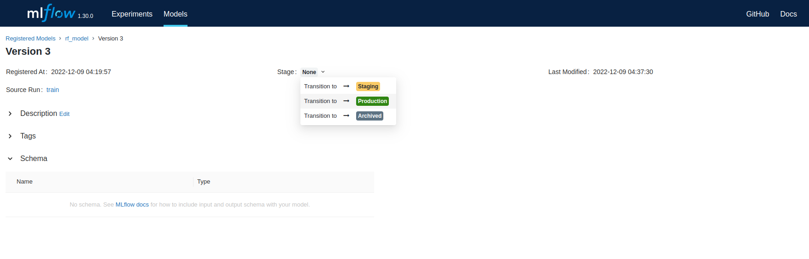

# Homework №3
Для запуска выполнить
```
./run.sh
```
После запуска Airflow развернется по адресу http://localhost:8080
```commandline
login = admin
password = admin
```

Для выбора модели на production откройте UI Mlflow по адресу http://localhost:5000/#/models и измените stage
 нужной модели на Production


После этого для ежедневыных предсказаний будет выбрана именно эта модель.

Для остановки Airflow выполнить
```
./stop
```